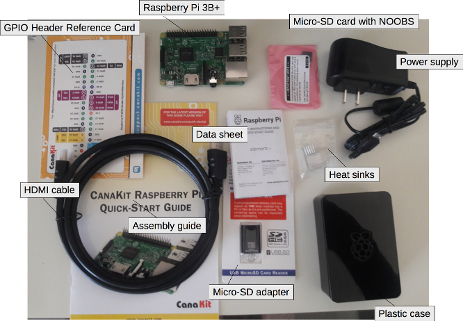
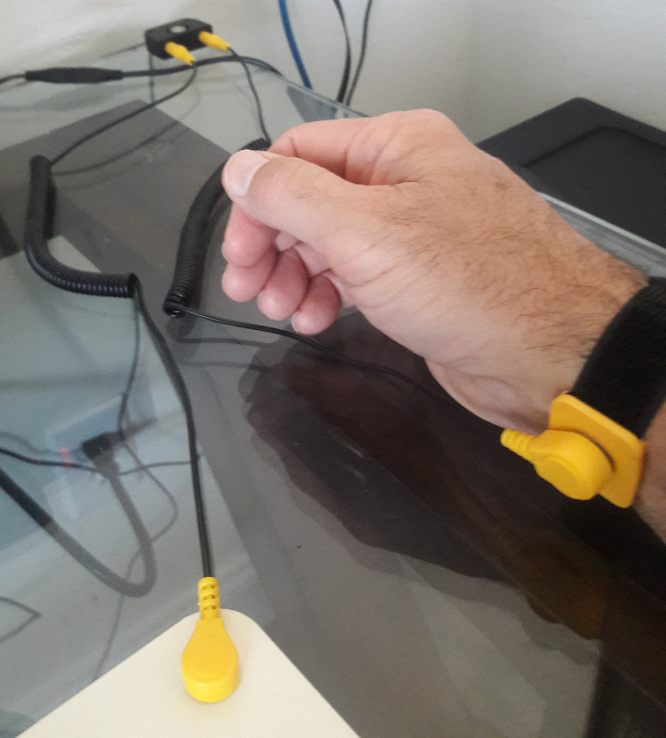
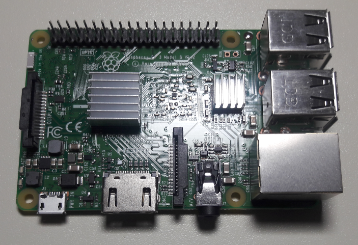
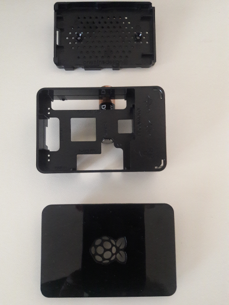
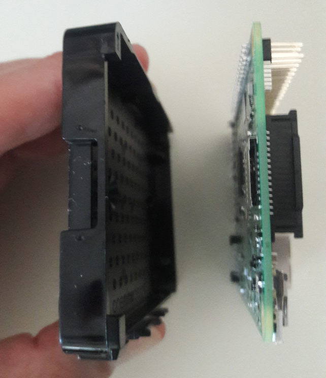
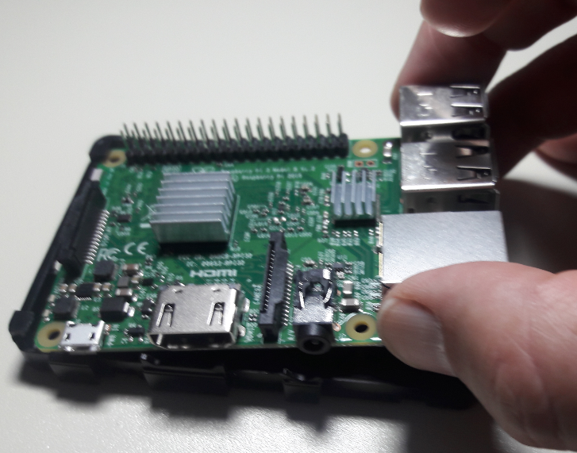
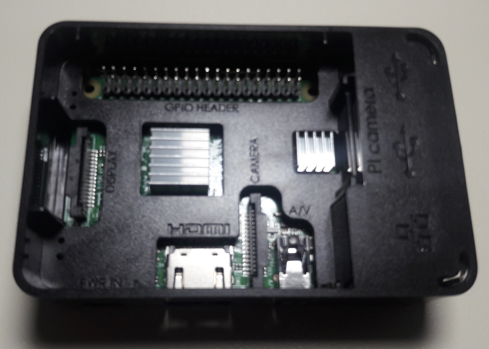
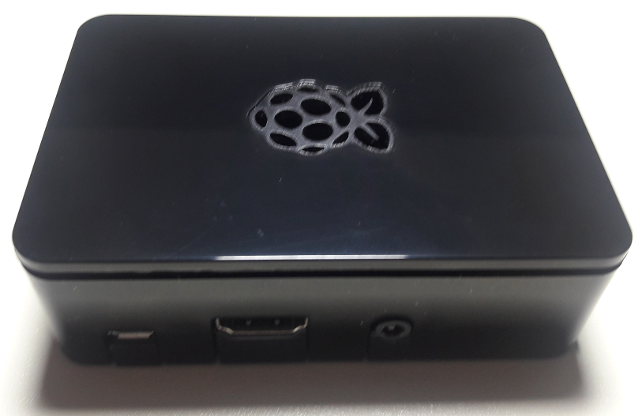

[top](README.md)

# Raspberry Pi CanaKit Assembly

What's in the CanaKit box?

The Raspberry Pi 3B+ comes with Ethernet and wireless adapters, three USB ports, and an HDMI port. That makes it a pretty good base for a general-purpose desktop computer.

The kit comes with most everything we need. Kits from other companies are similar. The micro-SD card is pre-loaded with New Out of Box Software, or NOOBS. That's a bootstrapper for installing an operating system. Without it, we'd have to build an operating system for the ARM architecture and load it onto a micro-SD ourselves. NOOBS is a time-saver.

The micro-SD adapter is included just in case we need to re-load the micro-SD card from a PC or Mac. 

Safety first: Put on your anti-static wristband. The photo shows a common ground point in the background. It's grounded to the building wiring, and connected to the anti-static mat and to the wristband.

One of the most challenging steps in assembling the unit is the removal of the paper backing from the self-adhesive heat sinks. Good luck.

The plastic case pulls apart into three parts like so:

The battery has nothing to do with the assembly. It's only there to lift one side of the case body for the photo.

Orient the board so that the micro-SD port aligns with the slot on the case bottom. 

Gently insert the Pi into the case bottom. Slide the end opposite the USB ports under the plastic tabs at the corners of the base bottom and let the board lay down into the case bottom. Don't push on it; it doesn't snap in. 

Slide the case body over the unit and onto the case bottom. They fit snugly together, but they don't snap. Be gentle. 

Fit the top of the case onto the body with the "leaves" of the Raspberry cut-out pointing toward the end where the USB ports are located. 

